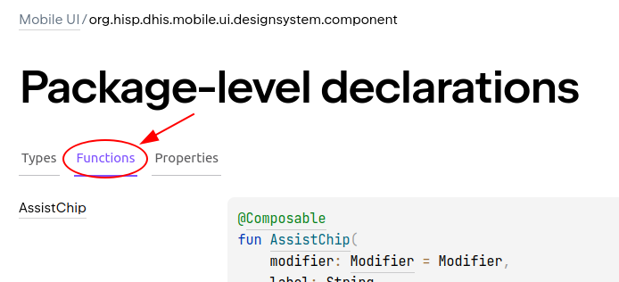

# API documentation

**DHIS2 Mobile UI library** API documentation is hosted
in [Github repository](https://dhis2.github.io/dhis2-mobile-ui/api/-mobile%20-u-i/org.hisp.dhis.mobile.ui.designsystem.component/index.html).

The package containing the different components is `org.hisp.dhis.mobile.ui.designsystem.component`. 
It is split in *types*, *functions* and *properties*. As in Compose, the components are considered
as functions, you will have all them in the *functions* section.

