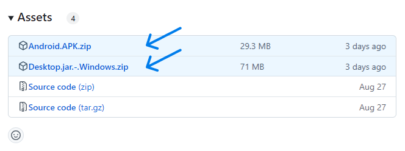

# Demo application

The Mobile UI library includes a demo application to showcase all the components. This application can be used to see the components on action.


Each release of the Mobile UI has artifacts for some of the targets. 
These artifacts can be found at the end of each [Release page](https://github.com/dhis2/dhis2-mobile-ui/releases) on Github, on the Assets section.




---
id: demo
title: Demo Application
sidebar_position: 3
---

# Demo Application

The Mobile UI library includes a **demo application** that showcases all the components available in the library. This application allows you to see the components in action and understand how they can be integrated into your projects.


## Downloading the Demo Application

Each release of the Mobile UI library provides artifacts for various targets, including Android and desktop platforms. You can download the demo application from the **Assets** section at the bottom of each [release page](https://github.com/dhis2/dhis2-mobile-ui/releases) on GitHub.


### Steps to Download:

1. **Visit the Releases Page**: Go to the [Mobile UI releases page](https://github.com/dhis2/dhis2-mobile-ui/releases) on GitHub.
2. **Select a Release**: Choose the release version you are interested in.
3. **Scroll to Assets**: At the bottom of the release notes, find the **Assets** section.
4. **Download the Artifact**: Click on the appropriate file for your platform:
    - **Android**: Download the `Android.APK.zip` file.
    - **Desktop (Windows)**: Download the `Desktop.jar.-.Windows.zip` file.

## Installing the Demo Application

### On Android:

1. **Unzip the APK**: Unzip the `.zip` file to extract the `.apk` file inside.
2. **Transfer the APK**: Move the downloaded `.apk` file to your Android device if you downloaded it on another device.
3. **Enable Unknown Sources**: On your device, go to **Settings > Security**, and enable **Unknown Sources** to allow installations outside of the Google Play Store.
4. **Install the APK**:
    - Open a file manager app and navigate to the `.apk` file.
    - Tap the file to begin the installation process.
    - Follow the on-screen instructions to complete the installation.

### On Desktop:

1. **Ensure Java is Installed**:

    - The demo application requires the Java Runtime Environment (JRE) to run.
    - Download and install Java from the [official website](https://www.java.com/en/download/) if you haven't already.

2. **Extract the ZIP File**:

    - Locate the downloaded `.zip` file.
    - Right-click and select **Extract All**, or use your preferred extraction tool to unzip the contents.

3. **Run the JAR File**:

    - Open the extracted folder to find the `.jar` file.
    - **Double-Click Method**:
        - Simply double-click the `.jar` file to launch the application.
    - **Command Line Method**:
        - Open a terminal or command prompt.
        - Navigate to the directory containing the `.jar` file.
        - Run the command:
          ```
          java -jar your-demo-application.jar
          ```

   **Note**: If double-clicking the `.jar` file doesn't work, ensure that the file association for `.jar` files is correctly set to the Java Runtime Environment.

## Using the Demo Application

1. **Launch the App**: Open the demo application on your device.
2. **Explore Components**: Browse through the various components showcased in the app.
3. **Interactive Examples**: Interact with the components to see how they behave and respond.
