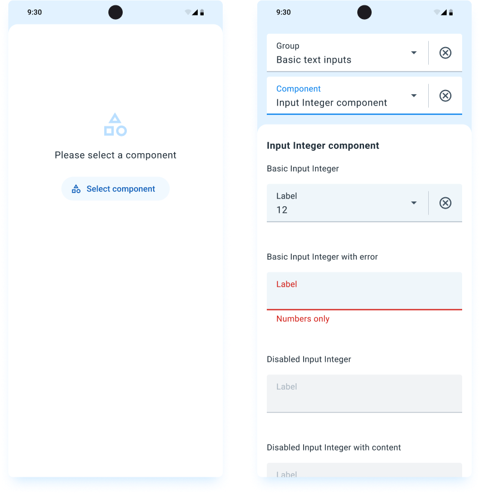

# Demo application

The Mobile UI library includes a demo application to showcase all the components. This application can be used to see the components on action.

Each release of the Mobile UI has artifacts for some of the targets. 
These artifacts can be found at the end of each [Release page](https://github.com/dhis2/dhis2-mobile-ui/releases) on Github, on the Assets section.

