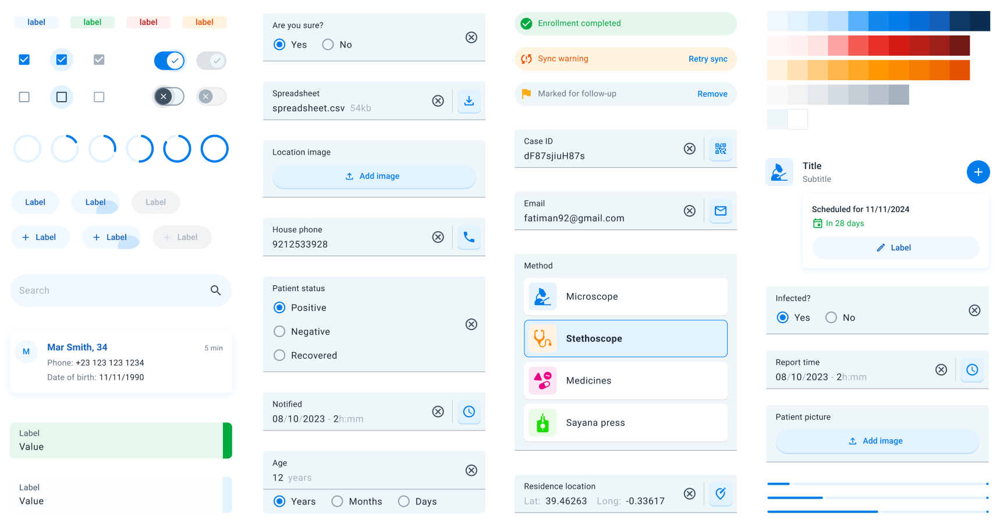

# Design System

The **DHIS2 Mobile UI Library** is built upon the [DHIS2 Mobile Design System Figma library](https://www.figma.com/file/eRk6bt0B8BJlTO9PZXirHN/DHIS2-Mobile-Design-System). This design system offers a comprehensive set of guidelines, components, and best practices to ensure consistency and enhance user experience across all DHIS2 mobile applications.

---

## Overview

The design system encompasses a wide array of elements that contribute to a cohesive and intuitive user interface. Below is an organized list of the key components and design principles included in the system:

### Foundations

1. **Color**: A curated palette of neutral colors used consistently throughout the UI to convey meaning and improve usability.
2. **Elevation**: Guidelines for applying shadows and depth effects to create a visual hierarchy and indicate interactivity.
3. **Icons**: A standardized set of icons representing common actions, objects, and statuses to enhance recognition and reduce cognitive load.
4. **Typography**: Consistent font styles and text hierarchies for headings, body text, and captions to improve readability and accessibility.
5. **Shape**: Principles for using shapes, such as rounded corners and specific aspect ratios, to maintain a consistent look and feel.

### Components

7. **Badges**: Small indicators that display numerical values or statuses, often attached to icons or avatars.
8. **Bottom Sheets**: Modal surfaces that slide up from the bottom of the screen to present supplementary content or actions without navigating away.
9. **Buttons**: Interactive elements that trigger actions, available in various styles like text, outlined, and contained buttons.
10. **Checkboxes**: Controls that allow users to select one or multiple options from a list, indicating selection with a checkmark.
11. **Chips**: Compact elements representing inputs, attributes, or actions, often used for filters or selections.
12. **Filter Bar** (WIP): A component that enables users to refine content displayed on the screen based on specific criteria.
13. **Forms**: Structured layouts for data entry, including input fields, dropdowns, and validation messages. They allow easily capture data for all the data entry types in the DHIS2 world.
14. **Indicators**: Used to provide specific information like feedback or program indicators.
15. **Info Bar**: A horizontal component that displays brief messages, alerts, or notifications to the user.
16. **Navigation Bar**: A bar located at the bottom of the screen for primary navigation between app sections.
17. **Progress Indicators**: Linear and circular indicators that show the progress of a task or process.
18. **Radio Buttons**: Controls that allow users to select a single option from a set, displaying the selection with a filled circle.
19. **Lists**: Organized collections of items, and cards to display text, images, or interactive elements, ready for DHIS2 objects.
20. **Menu**: A list of options or actions presented contextually or via a dedicated button, often used for secondary navigation.
21. **Search Bar**: An input field where users can enter queries to search and filter content within the app.
22. **Section Title (WIP)**: Headers that introduce and label different sections or groupings of content for better organization.
23. **Sections**: Divisions within a page or screen that group related content or functionality together.
24. **Snackbar**: Temporary messages that appear at the bottom of the screen to provide brief feedback about an operation.
25. **Switches**: Toggles that allow users to turn options or settings on or off, indicating the current state immediately.
26. **Tags**: Labels used to categorize, organize, or filter content, displayed as small, rounded rectangles.
27. **Top Bar**: The header area at the top of the screen, usually containing the app title, navigation controls, and action items.

---

## Getting Started

To incorporate the DHIS2 Mobile Design System into your project:

1. **Explore the Figma Library**: Familiarize yourself with the available components and styles by accessing the [Figma library](https://www.figma.com/file/eRk6bt0B8BJlTO9PZXirHN/DHIS2-Mobile-Design-System).
2. **Follow the Guidelines**: Apply the design principles and component guidelines to ensure a consistent and user-friendly interface.
3. **Maintain Accessibility**: Ensure all design elements meet accessibility standards for color contrast, font sizes, and interactive elements.
4. **Collaborate and Contribute**: Share feedback, suggest improvements, or contribute new components to help evolve the design system.

---

For more information or feedback, please visit the [DHIS2 Community of Practice](https://community.dhis2.org/c/development/10).

---