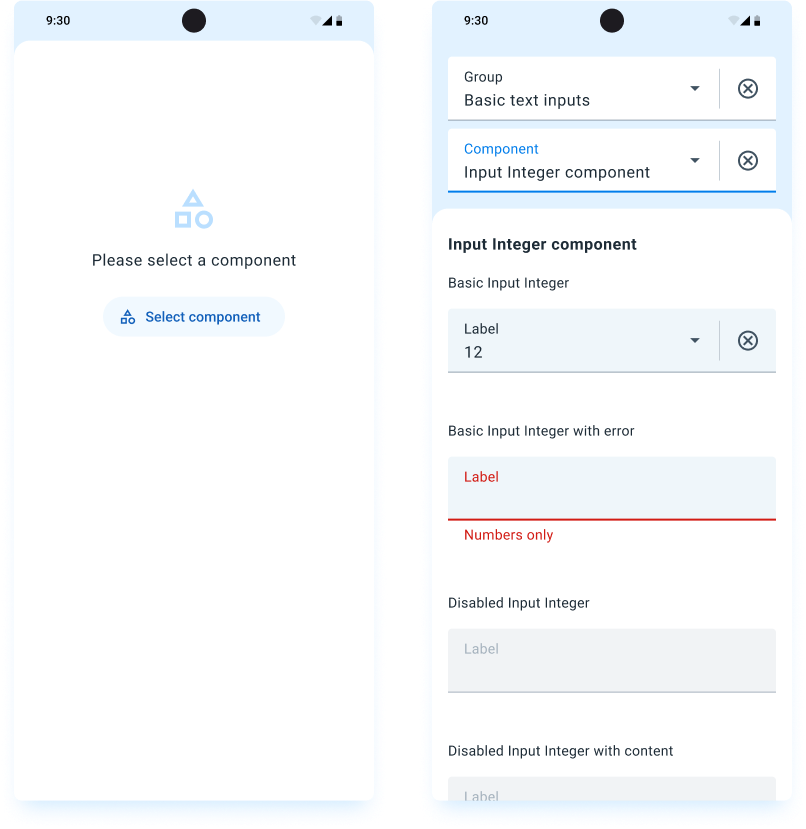

# Showcase Application

The Mobile UI library includes a **demo application** that showcases all the components available in the library. This application allows you to see the components in action and understand how they can be integrated into your projects.



## Downloading the Showcase application

Each release of the Mobile UI library provides artifacts for various targets, including Android and desktop platforms. You can download the demo application from the **Assets** section at the bottom of each [release page](https://github.com/dhis2/dhis2-mobile-ui/releases) on GitHub.

### Steps to Download:

1. **Visit the Releases Page**: Go to the [Mobile UI releases page](https://github.com/dhis2/dhis2-mobile-ui/releases) on GitHub.
2. **Select a Release**: Choose the release version you are interested in.
3. **Scroll to Assets**: At the bottom of the release notes, find the **Assets** section.
4. **Download the Artifact**: Click on the appropriate file for your platform:
    - **Android**: Download the `Android.APK.zip` file.
    - **Desktop (Windows)**: Download the `Desktop.jar.-.Windows.zip` file.


## Installing the Demo Application

### On Android:

1. **Unzip the APK**: Unzip the `.zip` file to extract the `.apk` file inside.
2. **Transfer the APK**: Move the downloaded `.apk` file to your Android device if you downloaded it on another device.
3. **Enable Unknown Sources**: On your device, go to **Settings > Security**, and enable **Unknown Sources** to allow installations outside of the Google Play Store.
4. **Install the APK**:
    - Open a file manager app and navigate to the `.apk` file.
    - Tap the file to begin the installation process.
    - Follow the on-screen instructions to complete the installation.

### On Desktop:

1. **Ensure Java is Installed**:

    - The demo application requires the Java Runtime Environment (JRE) to run.
    - Download and install Java from the [official website](https://www.java.com/en/download/) if you haven't already.

2. **Extract the ZIP File**:

    - Locate the downloaded `.zip` file.
    - Right-click and select **Extract All**, or use your preferred extraction tool to unzip the contents.

3. **Run the JAR File**:

    - Open the extracted folder to find the `.jar` file.
    - **Double-Click Method**:
        - Simply double-click the `.jar` file to launch the application.
    - **Command Line Method**:
        - Open a terminal or command prompt.
        - Navigate to the directory containing the `.jar` file.
        - Run the command:
          ```
          java -jar your-demo-application.jar
          ```

   **Note**: If double-clicking the `.jar` file doesn't work, ensure that the file association for `.jar` files is correctly set to the Java Runtime Environment.

## Using the Demo Application

1. **Launch the App**: Open the demo application on your device.
2. **Explore Components**: Browse through the various components showcased in the app.
3. **Interactive Examples**: Interact with the components to see how they behave and respond.
